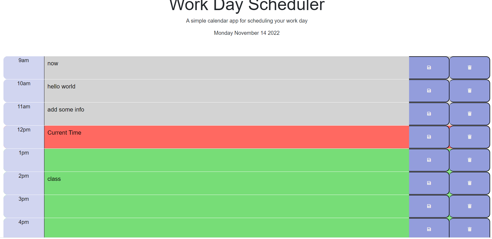

# Work-Scheduler

Work Day Scheduler this ultimate daily planner.
Use this tool to write down today tasks by hour and save them.
You can also edit or delete the task when you complete.
After click on btn "delete" or "save" you can see
"Appoitment added to localStorage" or
"Deleted added from localStorage".
When page is refreshed, the saved events persist.
Scrolled down the user is presented with time blocks for standard business hours (9AM-5PM).
Each time block is color coded to indicate whether it is in past(color:#d3d3d3),
present(color:#ff6961),furure(color:#77dd77).
Also in present color you can see "current time".

# Installation
N/A

# Usage

# Credits
N/A

# License
https://mary90272.github.io/Work-Scheduler/
